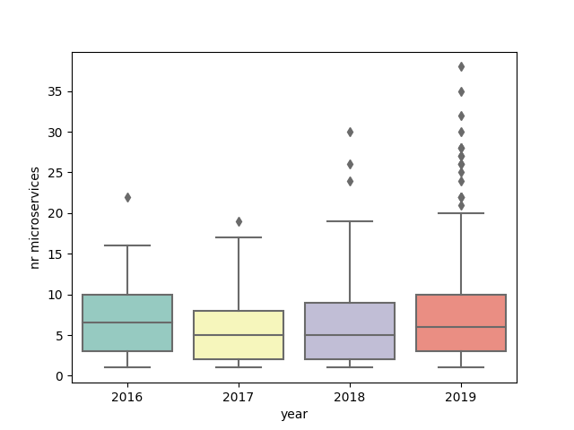
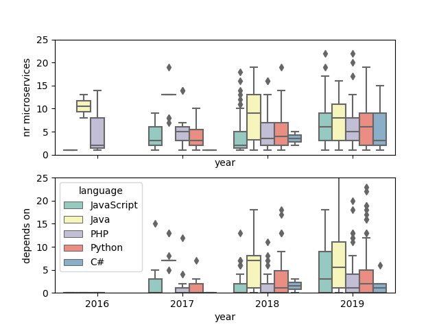
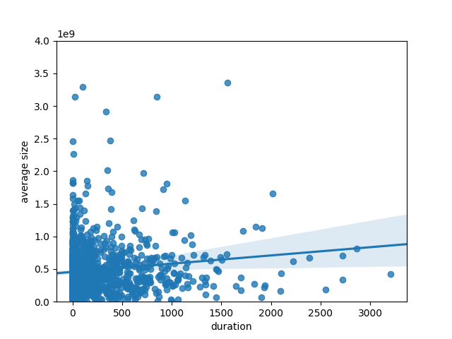
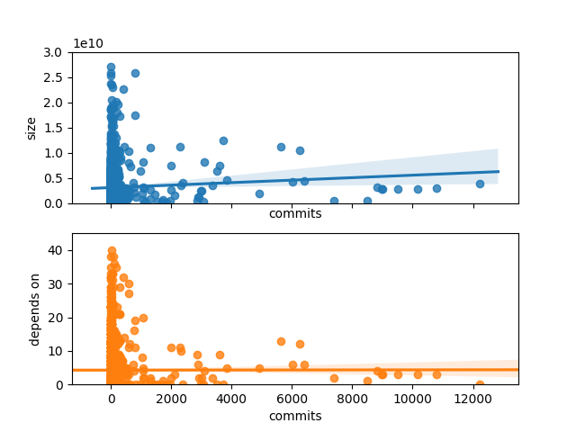
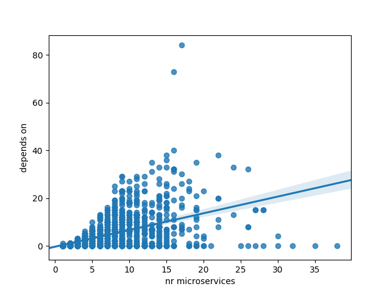

# An Empirical Investigation on the Evolution of Project Dependencies in Modern Software Systems

### Introduction

Dependencies are a big part of current software as building everything from scratch is very infeasible and not efficient. The evolution of dependencies is an interesting topic to analyze as it gives you a better understanding of the software architecture and possibly makes the software maintenance progress easier. In our project we are analyzing dependencies in the apache echosystem. Because many projects tend to move to the cloud, ways to analyze dependencies change. Therefore, also projects using the microservice architecture are analyzed in terms of their dependencies. Last but not least we are comparing the original microservice architecture to the acutal result of the implementation with the help of existing visualization tools.

### Goals

The goal of this is project is to investigate how dependencies evolve in modern ecosystems and affect their respective projects with a focus on the apache ecosystem, microservices projects, and visualization. We came up with the following research questions:

- RQ1:  How does the usage of dependencies correlate with code destabilization, as measured by the amount of issues and bugs after a project release?
- RQ2: Do newer (by looking at latest commit) projects have more and smaller (in terms of megabyte of the underlying container) microservices?
- RQ3: With increasing number of microservices in a project, how do the dependencies between them evolve?
- RQ4: Is it possible to deduct from its dependencies the architecture of a project with a microservice architectural style using a visualization tool?

### Part 1: Traditional Ecosystems

#### Introduction to Maven and Gradle

The Gradle Build Tool and Apache Maven are some of the more well-known software project management tools. They are, amongst other things, managing project dependencies. Gradle stores its dependencies in a file named "build.gradle" in the main directory; Maven projects have a "pom.xml" file. Both files can be analyzed in order to extract the number of dependencies as well as several more details like version numbers. In our project, we focus exclusively on projects that have one of these files in the main directory.

#### Hypotheses and Methodology

In order to answer RQ1, we intended to analyze Maven and Gradle projects by fetching the number of dependencies over the project's respective lifespan, cross-match the dependencies with the releases of such a project and then fetch the number of bugs in the weeks following the release. We hypothesize that having more dependencies results in more bugs as well; and since dependencies are often added to projects with a care-free attitude, it seems important to understand how to add dependencies responsibly.

We proceeded to write a python script that would allow us to automatically perform the aforementioned tasks by scanning the Apache ecosystem on Github. Specifically, our script works the following way:

Identification of suitable projects -> Cloning into a local repository -> Creation of dependency timeline via checkout of the dependency file -> Creation of release timeline -> Fetching of bug data -> Merge available data into a single .txt file -> Clean-up of data, clearing folders

#### Data mining

The identification of suitable projects is done via repeated Github requests. Through string slicing, a list of projects is compiled from the response and then pre-checked for the existence of either a "build.gradle" or a "pom.xml" in its main directory.

The script clones the Github projects one by one via command line calls. Before cloning, the folder is being cleared such that disk space does not run out in the process.

Via repeated git checkout commands, the dependency files or each project are sequentially downloaded, and their dependencies stored (with their dates included).

All releases of a project are fetched from Github via URL request and subsequent string analysis.

Based on the releases, requests are sent to Jira, an online project management tool. The number of bug entries is fetched, as per standard the number of bugs up to two weeks after the release date. Note that not all projects have associated Jira pages and therefor, our script fails to provide a bug number.

From the available data up to this point, a cumulative output is created and written into a .txt file. This output may be further analyzed and interpreted by our script (to gain more information about the type of dependencies per project) or written into excel files for further processing.

#### Results

Of the first 100 repositories, 37 were usable in terms of dependency files, releases on Github and bug reports on Jira. A total of 344 data tuples of the format "dependencies, release_date, bugs" were extracted and plotted. Figure 1 shows all tuples sorted by the number of dependencies (highest first), including linear trend lines. Figure 2 shows all tuples cumulated over time. Note that for presentation purposes, the time scale is not linear; it extends from 2014 to 2019 with comparatively few data points in the first years.


#### Discussion


### Part 2: Microservices

#### Introduction to Docker and docker compose files

Docker allow a user to create containers. Containers are self-contained, standalone bundles of software which are run in a closed a environment. Often Docker is compared to a Virtual Machine (VM), inspite of being implemented differently: Instead of allocating resources to each Virtual Machine and not sharing those across others, Docker containers run in the same operating system as its host. This way different containers can have access to a lot of the operating system resources, which leads to very lightweight containers. Nevertheless containers come with all they need, the app itself, all the required binaries and libraries. As a result, every computer with Docker installed is able to run those containers without any further configuration. This technology facilitates the deployment process drastically since it is ensured that containers run on every Docker client regardless of their underlying architecture.

To take it a step further, consider a system with many different containers and maybe even multiple instances of all of them, running them all manually can be very tedious. This is where a docker compose file comes into play. It allows to give all the required instructions in a single file. This file can be run with a single command and starts up all the required containers automatically. 

Docker compose files contain a lot of valuable information and is the main resource for this section.

#### Methodology
##### Fetching projects

With the help of a python script we query the Github API for repositories containing docker-compose.yml files in their
root directory. This makes further analysis easier since you don't have to search for the file inside the repository. The following parameters were used for the code search request:

```python
sizes = ["1..2000", "2001..4000", "4001..6000", "6001..8000", "8001..10000"]

res = session.get('https://api.github.com/search/code',
                              params={'q': 'path:/ filename:docker-compose.yml size:' + size,
                                      'sort': 'stars',
                                      'order': 'desc',
                                      'per_page': per_page,
                                      'page': page})
```

The Github API currently has a limit of 1000 repositories. In order to get more than 1000 results, we used a little trick:
By splitting up the search into multiple size intervals results in two benefits. First, we are able to have more results, secondly,
you automatically obtain a good mixture of smaller and bigger projects.

From this response the repository urls can be extracted and fetched in the next step. 

That way, most of the important data for later was extracted from the repository responses. The following data was obtained:

1. Project name
2. Creation & last updated date, which were then used to calculate the duration of the project
3. Main language of the project
4. Number of contributors to the project
5. Number of commits in the project (excluding merge commits)

Those metrics were stored in pickle files, which is the python way of storing objects to disk. Also, in order to be able to analyze the microservices of each project, the content of the repositories have to be looked at. 

##### Analyzing microservices

After having downloaded all the lateste releases of the projects onto disk, the goal was to additionally get the following information for all projects:

1. Number of microservices
2. Size of each microservice

In order to get the actual size of all the microservices for each project, the docker image directory was changed to an
external hard drive. That way we could prevent our machine from running out of memory and not delete all the images
after each project, which would have been very inefficient in case of docker (because they use a hashing mechanism for images). On Ubuntu, the default location for storing docker images can be changed by creating the following file:
/etc/docker/deamon.json. Add the following code snippet to the file, where "/mnt/hdd/docker" is replaced by your destination path:

```json
{
    "data-root": "/mnt/hdd/docker"
}
```

Note however, that for the amount of projects we analyzed, 2TB of storage was not enough and thus we had to clean up our images after some time in order to be able to continue the analysis.

Our script runs an analysis on the docker-compose.yml file for each project. This file stores all the relevant information we require.
What is most important in our case are the fields "image", "build", and "depends_on" inside "services". A complete specification of the docker-compose file can be found [here](https://docs.docker.com/compose/). An example of such a file looks like this:

```yaml
version: '3'
services:
  web:
    build: .
    ports:
    - "5000:5000"
    volumes:
    - .:/code
    - logvolume01:/var/log
    links:
    - redis
  redis:
    image: redis
volumes:
  logvolume01: {}
```

To obtain the correct image size, we distinguish the following cases:

1. Only "image" field is present: Pull the image
2. "build" field is present, either with or without subfields: build the image 
   1. Subfields: Build the image at location specified in "context". If "dockerfile" present, append the name to the path, otherwise the default "Dockerfile" is used
   2. No subfields: Build the image located at "build"

During this process, one can encounter many different errors. We found the following reasons for errors that occurred in our dataset:
1. Private image, cannot download
2. Error during building
3. Image cannot be found
4. Variables inside path names (variables are specified in '{}')
5. No build or image was specified for a microservice
6. Could not download image (HTTP Error)

In all of the above cases, a value of -1 was returned from the get_service_size() function. Whenever there was a -1 response for at least one microservice in a project, the entire project was not considered for further analysis and was deleted. Consequently, we only considered project with none of the above errors.

For building and pulling images [docker-py](https://github.com/docker/docker-py) was used. Both the pull and build functions return
images which have a size attribute. For each service listed, it was stored inside the pickled project object (inside the microservices field)  with the name and its size. Therefore, the number of microservices can be easily obtained by checking the length of this list.

To get the dependencies between microservices, we counted all the entries in "depends_on" fields inside each microservice. It should be noted that these dependencies are of static nature. Further research could also analyze a more dynamic view of the dependencies and compare them to our findings.

#### Data
Once both of the above script had been run, for each project there was a pickled python object stored on disk. The project object has the following properties:

| Field Name | Description | Type |
|------------|-------------|------|
| name | github name of the project | string |
| url | api url to the repository | string |
| created | date of the creation | datetime |
| last_updated | date of the last update | datetime |
| microservices | List of all microservices in the project | list of dictionaries with fields: 'name' and 'size' |
| depends_on | Number of dependencies of all microservices combined | int |  
| language | Main language used in the project | string |
| contributors | Number of contributors to the project | int |

#### Results

The following plots are only a selection of all the created ones. All plots can be found [here](Python/Docker/results).

In order to answer RQ2, we looked at the "last updated" timestamp of the Github repository. We found that there is only a slight trend towards newer projects having more microservices. However, there are more outliers on the upper bound in the year 2019. It should be noted that the plots for project size, average container size, and number of dependencies yield very similar result.



However, if we control for language as well, we observed that java had the most number of microservices and dependencies between them compared to all other chosen languages. We assume that this is the case because java is an established language and therefore often used in enterprise. Surprisingly, the same argument cannot be used for C#, which we expect to be used largely in enterprise as well.



In addition I observed the duration, not only the last updated timestamp. Intuitively, it makes a lot of sense that projects with longer developement durations tend to have more microservices and dependencies. Also, the size of both the entire project and the average container size grows with longer project duration. The following figure illustrates the relationship between the average container size and the project duration. Very similar findings were found for the other 3 values (microservices, dependencies and total size).



Also, contributors were analysed, however nothing interesting was the result. Looking at a measure that describes effort, such as commits, was more interesting. It seems that there is a trend for project size to go up but dependencies remaining constant. It seems reasonable to us that dependencies are not dependent on the number of commits. The project architecture seems to be defined in an early stage and later commits mainly add functionality to existing containers. 



To answer RQ3, a scatter plot was created to illustrate the relationship between the number of microservices in a project and the total dependencies between them. Against our expectations, there seems to be a more or less linear relationship between the two factors. 



### Part 3: Visualization


