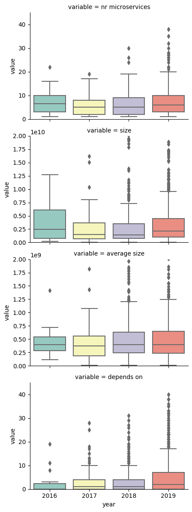
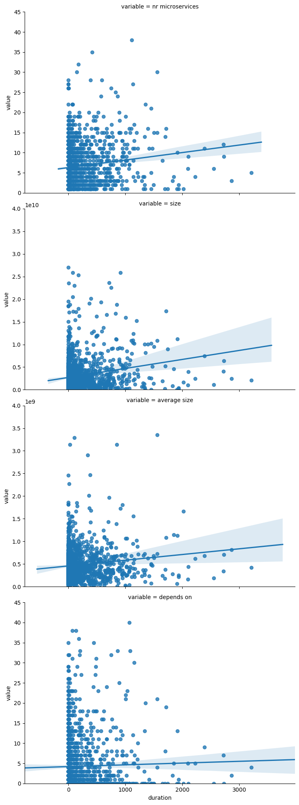
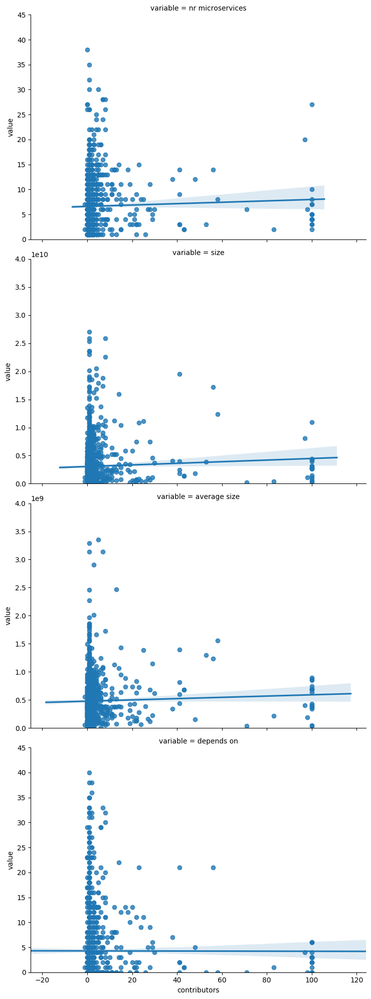

# An Empirical Investigation on the Evolution of Project Dependencies in Modern Software Systems

### Introduction

1. Modern software systems
2. Dependencies
2. Following chapters

### Goals

RQ1:  How does the usage of dependencies correlate with code destabilization, as measured by the amount of issues and bugs after a project release?

### Part 1: Traditional Ecosystems

#### Introduction to Maven and Gradle

The Gradle Build Tool and Apache Maven are some of the more well-known software project management tools. They are, amongst other things, managing project dependencies. Gradle stores its dependencies in a file named "build.gradle" in the main directory; Maven projects have a "pom.xml" file. Both files can be analyzed in order to extract the number of dependencies as well as several more details like version numbers. In our project, we focus exclusively on projects that have one of these files in the main directory.

#### Hypotheses and Methodology

In order to answer RQ1, we intended to analyze Maven and Gradle projects by fetching the number of dependencies over the project's respective lifespan, cross-match the dependencies with the releases of such a project and then fetch the number of bugs in the weeks following the release. We hypothesize that having more dependencies results in more bugs as well; and since dependencies are often added to projects with a care-free attitude, it seems important to understand how to add dependencies responsibly.

We proceeded to write a python script that would allow us to automatically perform the aforementioned tasks by scanning the Apache ecosystem on Github. Specifically, our script works the following way:

Identification of suitable projects -> Cloning into a local repository -> Creation of dependency timeline via checkout of the dependency file -> Creation of release timeline -> Fetching of bug data -> Merge available data into a single .txt file -> Clean-up of data, clearing folders

#### Data mining

The identification of suitable projects is done via repeated Github requests. Through string slicing, a list of projects is compiled from the response and then pre-checked for the existence of either a "build.gradle" or a "pom.xml" in its main directory.

The script clones the Github projects one by one via command line calls. Before cloning, the folder is being cleared such that disk space does not run out in the process.

Via repeated git checkout commands, the dependency files or each project are sequentially downloaded, and their dependencies stored (with their dates included).

All releases of a project are fetched from Github via URL request and subsequent string analysis.

Based on the releases, requests are sent to Jira, an online project management tool. The number of bug entries is fetched, as per standard the number of bugs up to two weeks after the release date. Note that not all projects have associated Jira pages and therefor, our script fails to provide a bug number.

From the available data up to this point, a cumulative output is created and written into a .txt file. This output may be further analyzed and interpreted by our script (to gain more information about the type of dependencies per project) or written into excel files for further processing.

### How to use the script

In order to use the script, the following libraries have to be installed:

- requests
- bs4
- openpyxl

Depending on the python version, one of the following commands can be used for the installation:

```shell script
py -m pip install requests
```

or, alternatively

```shell script
pip install requests
```

Our script can be operated from "main.py". Open the file in an IDE of your choice. The following functions (from "functions.py") may be used:

| Command | Description | Arguments |
|------------|-------------|------|
| clear_main | Erases files and clears folders | List with file and folder names |
| generate_Apache_link_list | Creates a .txt file with links to Apache projects on Github | Integer designating the number of pages to be fetched |
| write_dependency_timelines | Clones all repositories one by one and writes their dependencies into a .txt file in the dependency folder | Filename and directory of the Apache link .txt, the maximum number of repositories to be downloaded and a boolean designating whether the dependencies should be spelled out |
| write_release_timelines | Fetches the releases for each project in the Apache link .txt | Filename and directory |
| write_complete_timeline | Gathers all available data into a single file and adds the number of bugs found on Jira | Filename, time period for which to fetch the number of bugs per release (set to 14 days by default) and whether or not to include the release dates in the output file |
| clean_up | Cleans a .txt file such that only complete (as in: contain a dependency and a bug number) lines remain | Filename, directory and a boolean designating whether the project names should be included |
| dependency_interpreter | For a given file with spelled out dependencies, fetches the number of dependencies with certain properties (see comments in "functions.py") | Filename and directory |
| convert_to_excel | Converts a given file to excel | Filename and boolean as to whether the date should be converted to an integer for easier sorting |
| median_calc | Supplementary function to calculate the median of the number of dependencies over the lifespan of a project | Filename |

### Part 2: Microservices

#### Introduction to Docker and docker compose files

An example of a containerised application is a docker image of a MySQL Server. 
With the help of a Docker Container this application runs in a closed environment, 
much like a Virtual Machine, yet it is implemented completely differently.
Instead of allocating resources to each Virtual Machine and not sharing those across others,
Docker containers run in the same operating system as its host. This way different containers can have access
to a lot of the operating system resources, which leads to very lightweight containers.

Image a system with many different containers, running them all manually can be very tedious. This is where a docker compose file
comes into play. It allows to give all the required instructions in a single file. This file can be run with a single command
and starts up all the required containers automatically. 

Docker compose files contain a lot of valuable information and is the main resource for this section.

#### Methodology
##### Fetching projects

Note: Before running the script make sure that you have all the dependencies installed. Do:

```shell script
pip install -r Python/Docker/requirements.txt
```

The data can be fetched using the following command:

```shell script
python Python/Docker/repo_fetching.py
```

Note, that you change the API_KEY variable to one of your own Github API keys before running the script and that
you have all dependencies installed specified in the requirements.txt file.

In a bit more detail, this script queries the Github API for repositories containing docker-compose.yml files in their
root directory. This makes further analysis easier since you don't have to search for the file inside the repository.
Furthermore, out of all the matching repositories, only the first 1000 were downloaded and will be analyzed in the next
steps. 

```python
res = session.get('https://api.github.com/search/code',
                              params={'q': 'path:/ filename:docker-compose.yml size:' + size,
                                      'sort': 'stars',
                                      'order': 'desc',
                                      'per_page': per_page,
                                      'page': page})
```

The Github API currently has a limit of 1000 repositories. In order to get more than 1000 results, we used a little trick:
By splitting up the search into multiple size intervals results in two benefits. First, we are able to have more results, secondly,
you automatically obtain a good mixture of smaller and bigger projects.

From this response the repository urls can be extracted and fetched in the next step. 

That way, most of the important data for later was
extracted from the repository responses. The following data was extracted:

1. Project name
1. Creation & last updated date, which were then used to calculate the duration of the project
2. Main language of the project
3. Number of contributors to the project

Those metrics were stored in pickle files, which is the python way of storing objects to disk.
Also, in order to be able to analyze the microservices of each project, the content of the repositories have to be looked at.
The first step included downloading all the latest releases of the projects.

##### Analyzing microservices

The goal was to get the following information for all projects:
1. Number of microservices
2. Size of each microservice

In order to get the actual size of all the microservices for each project, the docker image directory was changed to an
external hard drive. That way we could prevent our machine from running out of memory and not delete all the images
after each project, which would have been very inefficient in case of docker. On Ubuntu, the default location for storing
docker images can be changed by creating the following file:
/etc/docker/deamon.json. Put into the file:

```json
{
    "data-root": "/mnt/hdd/docker"
}
```
Note however, that for the amount of projects we analyzed, 2TB of storage was not enough and thus we had to
clean up our images after some time in order to be able to continue the analysis.

After that, we ran the analysis with the following command:

```shell script
python Python/Docker/get_services_size.py
```

This script runs an analysis on the docker-compose.yml file for each project. This file stores all the relevant information.
What is most important in our case, are the fields "image", "build", and "depends_on" inside "services". A complete specification of the docker-compose file can be
found [here](https://docs.docker.com/compose/). An example of such a file looks like this:

```yaml
version: '3'
services:
  web:
    build: .
    ports:
    - "5000:5000"
    volumes:
    - .:/code
    - logvolume01:/var/log
    links:
    - redis
  redis:
    image: redis
volumes:
  logvolume01: {}
```

To obtain the correct image size, we distinguish the following cases:

1. Only "image" field is present: Pull the image
2. "build" field is present, either with or without subfields: build the image 
   1. Subfields: Build the image at location specified in "context". If "dockerfile" present, append the name to the path, otherwise the default "Dockerfile" is used
   2. No subfields: Build the image located at "build"

During this process, one can encounter many different errors. We found the following reasons for errors that occurred in our dataset:
1. Private image, cannot download
2. Error during building
3. Image cannot be found
4. Variables inside path names (variables are specified in '{}')
5. No build or image was specified for a microservice
6. Could not download image (HTTP Error)

In all of the above cases, a value of -1 was returned from the get_service_size() function.
Whenever there was a -1 response for at least one microservice in a project, the entire project was not considered for further
analysis and was deleted. Consequently, we only considered project with none of the above errors.

For building and pulling images [docker-py](https://github.com/docker/docker-py) was used. Both the pull and build functions return
images which have a size attribute. For each service listed, it was stored inside the pickled project object (inside the microservices list) 
with the name and its size. Therefore the number of microservices can be easily obtained by checking the length of this list.

To get the dependencies between microservices, we counted all the entries in "depends_on" fields inside each microservice. It should be noted
that these dependencies are of static nature.

Note: In order to be able to run the script, it may be required to allow docker to run commands as a non-root user. In
Linux this is done via the following commands:

```shell script
sudo groupadd docker
sudo usermod -aG docker $USER
```

#### Data
Once both of the above script had been run, for each project there was a pickled python object stored on disk.
The project object has the following properties:


| Field Name | Description | Type |
|------------|-------------|------|
| name | github name of the project | string |
| url | api url to the repository | string |
| created | date of the creation | datetime |
| last_updated | date of the last update | datetime |
| microservices | List of all microservices in the project | list of dictionaries with fields: 'name' and 'size' |
| depends_on | Number of dependencies of all microservices combined | int |  
| language | Main language used in the project | string |
| contributors | Number of contributors to the project | int |

#### Results






#### Discussion

### Part 3: Visualization


